# 🛂 PassportPAL: Multi-stage Identity Document Classification System

<div align="center">
  
  <p><em>PassportPAL in action: Intelligent ID document classification with precision and ease</em></p>
</div>

PassportPAL is a simple multi-stage document classification system that leverages cutting-edge deep learning to accurately detect, segment, and classify identity documents from different countries. Built with a modern tech stack and containerized for seamless deployment, PassportPAL offers a complete solution for automated identity document processing.

[](https://opensource.org/licenses/MIT)
[](https://www.python.org/downloads/release/python-3120/)
[](https://fastapi.tiangolo.com)
[](https://pytorch.org)
[](https://reactjs.org)
[](https://www.docker.com)

## 🌟 Features

- **📊 Dual-Stage ML Pipeline**: Document segmentation followed by precise classification
- **🔍 High Accuracy**: Classification performance with 98.67% accuracy, 98.75% precision, 98.67% recall, and 98.67% F1 score
- **⚡ Real-time Processing**: Optimized for speed with efficient inference
- **🖼️ Interactive UI**: Intuitive interface for document upload and analysis
- **🧰 Sample Gallery**: Pre-loaded examples for immediate testing
- **🚢 Containerized Deployment**: Simplified setup with Docker and Docker Compose
- **📝 Comprehensive Documentation**: Detailed guides for developers and users

## 📋 Table of Contents

1. [System Architecture](#-system-architecture)
2. [Technology Stack](#-technology-stack)
3. [Machine Learning Pipeline](#-machine-learning-pipeline)
4. [Performance Metrics](#-performance-metrics)
5. [Project Structure](#-project-structure)
6. [Running the Application](#-running-the-application)
7. [API Reference](#-api-reference)
8. [Development Guide](#-development-guide)
9. [License](#-license)

## 🏗️ System Architecture

PassportPAL employs a sophisticated architecture that seamlessly integrates machine learning with modern web technologies:

```mermaid
flowchart LR
    %% === MAIN FLOW ===
    User[👤 User] -->|Uploads Image| UI[📱 React Frontend]
    UI -->|HTTP Request| API[⚙️ FastAPI Backend]
    API -->|Processes Image| Segmentation[🔍 YOLOv11 Segmentation Model]
    Segmentation -->|Cropped Document| Classification[🏷️ CNN Classification Model]
    Classification -->|Prediction Results| API
    API -->|JSON Response| UI
    UI -->|Display Results| User

    %% === DATASET & TRAINING ===
    Dataset[(📊 Document Dataset)] -->|Training Data| ModelTraining[🧠 Model Training Pipeline]
    ModelTraining -->|Trained Models| Segmentation
    ModelTraining -->|Trained Models| Classification

    %% === SUBGRAPHS (DOCKER CONTAINERS) ===
    subgraph FrontendDocker["🐳 Frontend Container (Docker)"]

        direction TB
        UI
    end

    subgraph BackendDocker["🐳 Backend (Docker)"]
        direction TB
        API
        Segmentation
        Classification
    end

    %% === STYLING NODES ===
    style User fill:#AEDFF7,stroke:#333,stroke-width:2px,color:#000
    style UI fill:#D8BFD8,stroke:#333,stroke-width:2px,color:#000
    style API fill:#C1E1C1,stroke:#333,stroke-width:2px,color:#000
    style Segmentation fill:#F7C6C7,stroke:#333,stroke-width:2px,color:#000
    style Classification fill:#FAD7A0,stroke:#333,stroke-width:2px,color:#000
    style Dataset fill:#FFF3B0,stroke:#333,stroke-width:2px,color:#000
    style ModelTraining fill:#CBB2F5,stroke:#333,stroke-width:2px,color:#000

    %% === STYLING SUBGRAPHS ===
    style FrontendDocker fill:#FFFFFF,stroke:#888,stroke-width:2px,color:#000
    style BackendDocker fill:#FFFFFF,stroke:#888,stroke-width:2px,color:#000
```



The application follows a modern microservices architecture:

- **Frontend**: React-based SPA served by Nginx
- **Backend API**: FastAPI service that processes images and runs ML models
- **ML Pipeline**: Two-stage process with YOLOv11-seg for document detection and CNN for classification
- **Containerization**: Docker Compose for orchestrating services and ensuring consistent deployment

## 🔧 Technology Stack

### Backend Technologies

- **Python 3.12**: Core programming language
- **FastAPI**: High-performance API framework
- **PyTorch**: Deep learning framework for model training and inference
- **OpenCV**: Computer vision operations for image preprocessing
- **Ultralytics YOLOv11**: State-of-the-art object detection and segmentation
- **Albumentations**: Comprehensive image augmentation library

### Frontend Technologies

- **React 18**: Modern, component-based UI framework
- **TailwindCSS**: Utility-first CSS framework for sleek design
- **Vite**: Next-generation frontend tooling for faster development
- **React-Dropzone**: Intuitive file upload component
- **Axios**: Promise-based HTTP client for API requests

### DevOps & Deployment

- **Docker**: Application containerization
- **Docker Compose**: Multi-container orchestration
- **Nginx**: High-performance web server and reverse proxy

## 🧠 Machine Learning Pipeline

PassportPAL implements a sophisticated two-stage machine learning pipeline:

<div align="center">
  
  <p><em>Document segmentation in action: Precisely identifying document boundaries</em></p>
</div>

### Stage 1: Document Segmentation (YOLOv11)

The first stage uses YOLOv11's instance segmentation capabilities to:
1. Detect the document's presence in the image
2. Generate pixel-perfect masks around the document
3. Extract the document region for further processing

<div align="center">
  
  <p><em>Document extraction: From raw image to precisely cropped document</em></p>
</div>

#### Segmentation Model Training Details

- **Model Architecture**: YOLOv11m-seg
- **Dataset**: 307 custom-annotated images
- **Data Split**: 215 training, 61 validation, 31 testing images
- **Annotation Process**: Initial auto-annotation with Roboflow followed by manual verification
- **Training Performance**: Achieved 99.5% mAP50 and 99.3% mAP50-95 on validation data

<div align="center">
  
  <p><em>Segmentation model training metrics: Tracking loss and performance over training epochs</em></p>
</div>

#### Data Augmentation Strategy

Custom augmentation pipeline generated 7 variations of each source image:
- 50% probability of vertical flip
- Rotation variations: none, 90° clockwise, 90° counter-clockwise, 180°
- Random rotation between -15° and +15°
- Random shear between -10° and +10° horizontally and vertically
- Random brightness adjustment (±24%)
- Random exposure adjustment (±15%)

<div align="center">
  
  <p><em>Data augmentation in action: Creating diverse training examples from original images</em></p>
</div>

### Stage 2: Document Classification (CNN)

The second stage takes the segmented document and classifies it into one of 10 document types:

<div align="center">
  
  <p><em>Classification dataset: The 10 document types identified by PassportPAL</em></p>
</div>

#### Classification Model Architecture

A custom Convolutional Neural Network (CNN) with:
- Input normalization and resize to 224×224 pixels
- Multiple convolutional layers with batch normalization
- Global average pooling
- Dropout for regularization
- Fully connected output layer with 10 classes

#### Classification Performance

- **Accuracy**: 98.67%
- **Precision**: 98.75%
- **Recall**: 98.67%
- **F1 Score**: 98.67%

<div align="center">
  
  <p><em>Classification model training: Loss and accuracy over epochs</em></p>
</div>

<div align="center">
  
  <p><em>Confusion matrix: Visual representation of classification performance across document types</em></p>
</div>

#### Error Analysis

Our analysis identified a small number of misclassifications, primarily between visually similar document types:

<div align="center">
  
  <p><em>Misclassification examples: Understanding model limitations for future improvements</em></p>
</div>

### Dataset Challenges

The dataset presented several challenges that the models needed to overcome:

<div align="center">
  
  
  <p><em>Dataset variations: Handling multicolor objects (left) and background text interference (right)</em></p>
</div>

<div align="center">
  
  <p><em>Dataset challenge: Documents with multiple edges and complex backgrounds</em></p>
</div>

## 📊 Performance Metrics

### Segmentation Model Performance

training metrics:
```
metrics/precision(B): 0.98274
metrics/recall(B): 1.0
metrics/mAP50(B): 0.99254
metrics/mAP50-95(B): 0.99025
metrics/precision(M): 0.98274
metrics/recall(M): 1.0
metrics/mAP50(M): 0.99254
metrics/mAP50-95(M): 0.99173
```

Test metrics:
```
Class     Images  Instances      Box(P          R      mAP50  mAP50-95)     Mask(P          R      mAP50  mAP50-95):
all         61         60      0.983          1      0.995      0.993      0.983          1      0.995      0.994
```

### Classification Model Performance

Training metrics:
```
train Loss: 0.0816 Acc: 0.9829
val Loss: 0.0328 Acc: 0.9933
```

Test metrics:
```
Accuracy: 0.9867
Precision: 0.9875
Recall: 0.9867
F1 Score: 0.9867
```

Detailed classification report:
```
                      precision    recall  f1-score   support

              alb_id       1.00      1.00      1.00        15
        aze_passport       1.00      1.00      1.00        15
              esp_id       0.94      1.00      0.97        15
              est_id       1.00      1.00      1.00        15
              fin_id       1.00      0.93      0.97        15
        grc_passport       1.00      1.00      1.00        15
        lva_passport       1.00      0.93      0.97        15
rus_internalpassport       1.00      1.00      1.00        15
        srb_passport       0.94      1.00      0.97        15
              svk_id       1.00      1.00      1.00        15

            accuracy                           0.99       150
           macro avg       0.99      0.99      0.99       150
        weighted avg       0.99      0.99      0.99       150
```

## 📁 Project Structure

```
PassportPAL/
├── README.md                  # Main project documentation with setup instructions
├── LICENSE                    # MIT License file
├── docker-compose.yml         # Main Docker Compose configuration
├── .gitignore                 # Git ignore file
├── Task1/                     # Task1 folder
│   └── probability_of_finding_plane.pdf  # PDF file
│
├── dataset/                   # Dataset directory
│   ├── images/                # Raw dataset provided
│   ├── annotated_images/      # Images annotated with Roboflow
│   ├── cropped_images/        # Images after segmentation
│   └── samples/               # Sample images for UI and training graphs
│
├── model_development/         # Model development code
│   ├── classification/        # Classification model development
│   │   ├── train.py           # Training script
│   │   ├── simple_cnn_classification.py  # CNN model implementation
│   │   ├── models.py          # Model architecture definitions
│   │   └── dataset.py         # Dataset handling
│   │
│   └── segmentation/          # Segmentation model development
│       ├── roi_instance_segmentation.py  # Segmentation implementation
│       ├── failed_approaches.py # Documentation of approaches that didn't work
│       └── runs/              # Training runs and checkpoints
│
├── scripts/                   # Scripts directory
│   ├── start.ps1              # Docker startup script (Windows)
│   ├── start.sh               # Docker startup script (Linux/Mac)
│   ├── start_without_docker.ps1  # Local startup script (Windows)
│   ├── start_without_docker.sh   # Local startup script (Linux/Mac)
│   ├── docker-cleanup.ps1     # Docker cleanup script (Windows) 
│   ├── docker-cleanup.sh      # Docker cleanup script (Linux/Mac)
│   ├── download_models.ps1    # Model download script (Windows)
│   └── download_models.sh     # Model download script (Linux/Mac)
│
├── backend/                   # Backend service
│   ├── Dockerfile             # Backend Docker configuration
│   ├── requirements.txt       # Python dependencies
│   ├── main.py                # FastAPI application
│   ├── dataset.py             # Dataset handling code
│   ├── models/                # Directory for storing ML models
│   └── .dockerignore          # Docker ignore file
│
└── frontend/                  # Frontend service
    ├── Dockerfile             # Frontend Docker configuration
    ├── package.json           # NPM package configuration
    ├── src/                   # React source code
    │   ├── App.jsx            # Main application component
    │   ├── main.jsx           # Entry point
    │   └── index.css          # Global styles
    ├── public/                # Static assets
    │   └── samples/           # Sample images for testing
    ├── nginx.conf             # Nginx configuration
    └── .dockerignore          # Docker ignore file
```

## 🚀 Running the Application

<div align="center">
  
  <p><em>Landing page: The UI displays options to upload image and sample images to choose from.</em></p>
</div>

### Prerequisites

- **Docker** (version 20.10.0 or higher)
- **Docker Compose** (version 2.0.0 or higher)
- **Git** (for cloning the repository)

### Quick Start

1. **Clone the repository**:
   ```bash
   git clone https://github.com/tatkaal/passportpal.git
   cd passportpal
   ```

2. **Start the application using below script that downloas the Models and Docker Compose**:

   On Windows:
   ```powershell
   .\scripts\start.ps1
   ```

   On Linux/Mac:
   ```bash
   chmod +x ./scripts/start.sh
   ./scripts/start.sh
   ```
 (Build time is roughly 3 minutes with and image size of around 3Gb)

3. **Access the web interface**:
   Open your browser and navigate to:
   ```
   http://localhost
   ```

### User Workflow

1. **Upload an image**: Drag and drop or click to select an ID document image
2. **Processing**: The system automatically detects, segments, and classifies the document
3. **Results**: View the classification result, confidence scores, and segmentation output
4. **Sample Gallery**: Try pre-loaded examples by clicking on the sample images


## 🔌 API Reference

The backend exposes the following RESTful endpoints:

### `GET /api/status`

Check API and model availability.

**Response:**
```json
{
  "status": "online"
}
```

### `POST /api/analyze`

Analyze an uploaded document image.

**Request:** Form data with `file` field containing the image.

**Response:**
```json
{
  "class": "fin_id",
  "confidence": 0.982,
  "top3_predictions": [
    {
      "class": "fin_id",
      "confidence": 0.982
    },
    {
      "class": "est_id",
      "confidence": 0.015
    },
    {
      "class": "svk_id",
      "confidence": 0.003
    }
  ],
  "segmentation": "base64_encoded_image"
}
```

### `GET /api/get-sample`

Get a sample image for testing.

**Parameters:** `path` - Path to the sample image

**Response:** Binary image data

## 💻 Development Guide

### Manual Setup (Without Docker)

For development purposes, you can run the components separately:

#### Backend and Frontend:

On Windows:
```powershell
.\scripts\start_without_docker.ps1
```

On Linux/Mac:
```bash
chmod +x ./scripts/start_without_docker.sh
./scripts/start_without_docker.sh
```

### Model Download

If you need to manually download the machine learning models:

```bash
# On Windows
.\scripts\download_models.ps1

# On Linux/Mac
chmod +x ./scripts/download_models.sh
./scripts/download_models.sh
```

### Clean Docker Environment

If you encounter persistent issues, clean up your Docker environment:

```bash
# On Windows
.\scripts\docker-cleanup.ps1

# On Linux/Mac
./scripts/docker-cleanup.sh
```

## 📜 License

This project is licensed under the MIT License - see the [LICENSE](LICENSE) file for details.

## 🙏 Acknowledgments

- Ultralytics for the YOLO model architecture
- Roboflow for simplified dataset annotation tools
- PyTorch, FastAPI, and React communities for excellent frameworks
- The open-source community for sharing knowledge and resources
