# 🛂 PassportPAL: Multi-stage Identity Document Classification System 

<div align="center">
  
  <p><em>PassportPAL in action: Intelligent ID document classification with precision and ease</em></p>
</div>

PassportPAL is a simple multi-stage document classification system that leverages cutting-edge deep learning to accurately detect, segment, and classify identity documents from different countries. Built with a modern tech stack and containerized for seamless deployment, PassportPAL offers a complete solution for automated identity document processing.

[](https://opensource.org/licenses/MIT)
[](https://www.python.org/downloads/release/python-3120/)
[](https://fastapi.tiangolo.com)
[](https://pytorch.org)
[](https://reactjs.org)
[](https://www.docker.com)

## 🌟 Features

- **📊 Dual-Stage ML Pipeline**: Document segmentation followed by precise classification
- **🔍 High Accuracy**: Classification performance with 98.67% accuracy, 98.75% precision, 98.67% recall, and 98.67% F1 score
- **⚡ Real-time Processing**: Optimized for speed with efficient inference
- **🖼️ Interactive UI**: Intuitive interface for document upload and analysis
- **🧰 Sample Gallery**: Pre-loaded examples for immediate testing
- **🚢 Containerized Deployment**: Simplified setup with Docker and Docker Compose
- **📝 Comprehensive Documentation**: Detailed guides for developers and users

## 📋 Table of Contents

1. [Project Structure](#-project-structure)
2. [Running the Application](#-running-the-application)
3. [Development Guide](#-development-guide)
4. [System Architecture](#-system-architecture)
5. [Technology Stack](#-technology-stack)
6. [Machine Learning Pipeline](#-machine-learning-pipeline)
7. [Performance Metrics](#-performance-metrics)
8. [License](#-license)
9. [Acknowledgments](#-acknowledgments)

---

## 📁 Project Structure

```
PassportPAL/
├── README.md
├── LICENSE
├── docker-compose.yml
├── Task1/
├── dataset/
├── model_development/
│   ├── classification/
│   │   ├── custom_cnn_classification.ipynb
│   └── segmentation/
│       ├── roi_instance_segmentation.ipynb
│       └── failed_approaches.ipynb
├── scripts/
│   ├── start.ps1
│   ├── start.sh
│   ├── start_without_docker.ps1
│   ├── start_without_docker.sh
│   ├── docker-cleanup.ps1
│   ├── docker-cleanup.sh
│   ├── download_models.ps1
│   └── download_models.sh
├── backend/
└── frontend/
```

---

## 🚀 Running the Application

<div align="center">
  
  <p><em>Landing page: The UI displays an option to upload images and sample images to choose from.</em></p>
</div>

### Prerequisites

- **Docker** (version 20.10.0 or higher)
- **Docker Compose** (version 2.0.0 or higher)
- **Git** (for cloning the repository)

### Quick Start

1. **Clone the repository**:
   ```bash
   git clone https://github.com/tatkaal/passportpal.git
   cd passportpal
   ```

2. **Start the application using the script that downloads the models and runs Docker Compose**:

   On Windows:
   ```powershell
   .\scripts\start.ps1
   ```

   On Linux/Mac:
   ```bash
   chmod +x ./scripts/start.sh
   ./scripts/start.sh
   ```
   (Build time is roughly 3 minutes with an image size of around 3GB)

3. **Access the web interface**:
   ```bash
   http://localhost
   ```

### User Workflow

1. **Upload an image**: Drag and drop or click to select an ID document image.
2. **Processing**: The system automatically detects, segments, and classifies the document.
3. **Results**: View the classification result, confidence scores, and segmentation output.
4. **Sample Gallery**: Try pre-loaded examples by clicking on the sample images.

---

## 💻 Development Guide

### Manual Setup (Without Docker)

For development purposes, you can run the components separately:

On Windows:
```powershell
.\scripts\start_without_docker.ps1
```

On Linux/Mac:
```bash
chmod +x ./scripts/start_without_docker.sh
./scripts/start_without_docker.sh
```

### Model Download

If you want to manually download the machine learning models:

```bash
# On Windows
.\scripts\download_models.ps1

# On Linux/Mac
chmod +x ./scripts/download_models.sh
./scripts/download_models.sh
```

### Clean Docker Environment

If you encounter persistent issues, clean up your Docker environment:

```bash
# On Windows
.\scripts\docker-cleanup.ps1

# On Linux/Mac
./scripts/docker-cleanup.sh
```

---

## 🏗️ System Architecture

PassportPAL employs a sophisticated architecture that seamlessly integrates machine learning with modern web technologies:

```mermaid
flowchart TB
    %% === MAIN FLOW (TOP-DOWN) ===
    User[👤 User] -->|Uploads Image| UI[📱 React Frontend]
    UI -->|HTTP Request| API[⚙️ FastAPI Backend]
    API -->|Processes Image| Segmentation[🔍 YOLOv11 Segmentation Model]
    Segmentation -->|Cropped Document| Classification[🏷️ CNN Classification Model]
    Classification -->|Prediction Results| API
    API -->|JSON Response| UI
    UI -->|Display Results| User

    %% === DATASET & TRAINING ===
    Dataset[(📊 Document Dataset)] -->|Training Data| ModelTraining[🧠 Model Training Pipeline]
    ModelTraining -->|Trained Models| Segmentation
    ModelTraining -->|Trained Models| Classification

    %% === SUBGRAPHS (DOCKER CONTAINERS) ===
    subgraph FrontendDocker["🐳 Frontend (Docker)"]
        direction TB
        UI
    end

    subgraph BackendDocker["🐳 Backend (Docker)"]
        direction TB
        API
        Segmentation
        Classification
    end

    %% === STYLING NODES ===
    style User fill:#AEDFF7,stroke:#333,stroke-width:2px,color:#000
    style UI fill:#D8BFD8,stroke:#333,stroke-width:2px,color:#000
    style API fill:#C1E1C1,stroke:#333,stroke-width:2px,color:#000
    style Segmentation fill:#F7C6C7,stroke:#333,stroke-width:2px,color:#000
    style Classification fill:#FAD7A0,stroke:#333,stroke-width:2px,color:#000
    style Dataset fill:#FFF3B0,stroke:#333,stroke-width:2px,color:#000
    style ModelTraining fill:#CBB2F5,stroke:#333,stroke-width:2px,color:#000

    %% === STYLING SUBGRAPHS ===
    style FrontendDocker fill:#FFFFFF,stroke:#888,stroke-width:2px,color:#000
    style BackendDocker fill:#FFFFFF,stroke:#888,stroke-width:2px,color:#000
```



---

## 🔧 Technology Stack

**Backend**: Python 3.12, FastAPI, PyTorch, OpenCV, Ultralytics YOLOv11, Albumentations  
**Frontend**: React 18, TailwindCSS, Vite, Axios, React-Dropzone  
**DevOps**: Docker, Docker Compose, Nginx

---

## 🧠 Machine Learning Pipeline

PassportPAL implements a **two-stage** machine learning pipeline:

### Stage 1: Document Segmentation (YOLOv11)

1. Detect the document's presence in the image  
2. Generate pixel-perfect masks  
3. Extract the region for further processing  

<div align="center">
  
  <p><em>Document segmentation in action: Precisely identifying document boundaries</em></p>
</div>

**Segmentation Model Training Details**  
- **Architecture**: YOLOv11m-seg  
- **Dataset**: 307 custom-annotated images  
- **Data Split**: 215 training, 61 validation, 31 testing  
- **mAP50**: 99.5% on validation data  

<div align="center">
  
  <p><em>Segmentation model training metrics</em></p>
</div>

### Stage 2: Document Classification (CNN)

Classifies the segmented document into one of 10 document types.

<div align="center">
  
  <p><em>Classification dataset samples</em></p>
</div>

**Classification Model Architecture**  
- Custom CNN (input size 224×224)  
- Multiple convolutional layers with batch normalization  
- Global average pooling + dropout  
- Fully connected output layer (10 classes)  

**Classification Performance**  
- **Accuracy**: 98.67%  
- **Precision**: 98.75%  
- **Recall**: 98.67%  
- **F1 Score**: 98.67%

<div align="center">
  
  <p><em>Classification model training metrics</em></p>
</div>

---

### Dataset Challenges

<div align="center">
  
  
  
  <p><em>Dataset variations: Handling multicolor objects, background text interference, and multiple edges</em></p>
</div>

---

## 📊 Performance Metrics

### Segmentation Model

**Training:**
```
precision(B): 0.98274
recall(B): 1.0
mAP50(B): 0.99254
mAP50-95(B): 0.99025
precision(M): 0.98274
recall(M): 1.0
mAP50(M): 0.99254
mAP50-95(M): 0.99173
```

**Test:**
```
Class     Images  Instances      Box(P          R      mAP50  mAP50-95)     Mask(P          R      mAP50  mAP50-95):
all         61         60      0.983          1      0.995      0.993      0.983          1      0.995      0.994
```

### Classification Model

**Training:**
```
train Loss: 0.0816 Acc: 0.9829
val Loss: 0.0328 Acc: 0.9933
```

**Test:**
```
Accuracy: 0.9867
Precision: 0.9875
Recall: 0.9867
F1 Score: 0.9867
```

---

## 📜 License

This project is licensed under the MIT License - see the [LICENSE](LICENSE) file for details.

---

## 🙏 Acknowledgments

- Ultralytics for the YOLO model architecture
- Roboflow for simplified dataset annotation tools
- PyTorch, FastAPI, and React communities for excellent frameworks
- The open-source community for sharing knowledge and resources