# 🛂 PassportPAL: Multi-stage Identity Document Classification System

<div align="center">
  
  <p><em>PassportPAL in action: Intelligent ID document classification with precision and ease</em></p>
</div>

[](https://opensource.org/licenses/MIT)
[](https://www.python.org/downloads/release/python-3120/)
[](https://fastapi.tiangolo.com)
[](https://pytorch.org)
[](https://reactjs.org)
[](https://www.docker.com)

## 📋 Table of Contents

1. [Project Structure](#project-structure)
2. [Running the Application](#running-the-application)
3. [Development Guide](#development-guide)
4. [System Architecture](#system-architecture)
5. [Technology Stack](#technology-stack)
6. [Machine Learning Pipeline](#machine-learning-pipeline)
7. [License](#license)
8. [Acknowledgments](#acknowledgments)

---

<a id="project-structure"></a>
## 📁 Project Structure

```
PassportPAL/
├── README.md
├── LICENSE
├── docker-compose.yml
├── Task1/
├── dataset/
├── model_development/
│   ├── classification/
│   │   ├── custom_cnn_classification.ipynb
│   └── segmentation/
│       ├── roi_instance_segmentation.ipynb
│       └── failed_approaches.ipynb
├── development/
│   ├── setup_windows.py
│   ├── setup_unix.py 
├── backend/
└── frontend/
└── run_unix.py
└── run_windows.py
```

---

<a id="running-the-application"></a>
## 🚀 Running the Application

<div align="center">
  
  <p><em>Landing page: The UI displays an option to upload images and sample images to choose from.</em></p>
</div>

### Prerequisites

- **Docker** (version 20.10.0 or higher)
- **Docker Compose** (version 2.0.0 or higher)
- **Git** (for cloning the repository)
- **Python** (3.10+)

### Application Workflow

1. **Upload an image**: Drag and drop or click to select an ID document image.
2. **Processing**: The system automatically detects, segments, and classifies the document.
3. **Results**: View the classification result, confidence scores, and segmentation output.
4. **Sample Gallery**: Try pre-loaded examples by clicking on the sample images.

### Quick Start

1. **Start Docker/Docker desktop**

2. **Clone the repository**:
   ```bash
   git clone https://github.com/tatkaal/passportpal.git
   ```
   ```bash
   cd passportpal
   ```

3. **Install and Start the application by running the script in the terminal**:

   On Windows:
   ```powershell
   python run_windows.py
   ```

   On Linux/Mac:
   ```bash
   python run_unix.py
   ```

   **What does the script do?**
   - Checks if Docker is running
   - Downloads the segmentation and classification models from gdrive
   - Checks if the default ports (5000/80) are available
   - Runs Docker Compose build
   - Prompts build options if the image already exists
   - Runs the container
   - *(Build time is roughly 3 minutes with an image size of around 3GB)*

4. **Access the web interface**:
   ```bash
   http://localhost
   ```

### Manual Installation
- For detailed instructions, please check the [ManualInstallation.md](ManualInstallation.md) file.

---

<a id="development-guide"></a>
## 💻 Development Guide

### Manual Setup (For development purposes)

For development purposes, you can run both Frontend and Backend components separately:
```powershell
cd development
```

On Windows:
```powershell
python setup_windows.py
```

On Linux/Mac:
```bash
python setup_unix.py
```

---

<a id="system-architecture"></a>
## 🏗️ System Architecture

PassportPAL employs a sophisticated architecture that seamlessly integrates machine learning with modern web technologies:

```mermaid
flowchart TB
    %% === MAIN FLOW (TOP-DOWN) ===
    User[👤 User] -->|Uploads Image| UI[📱 React Frontend]
    UI -->|HTTP Request| API[⚙️ FastAPI Backend]
    API -->|Processes Image| Segmentation[🔍 YOLOv11 Segmentation Model]
    Segmentation -->|Cropped Document| Classification[🏷️ CNN Classification Model]
    Classification -->|Prediction Results| API
    API -->|JSON Response| UI
    UI -->|Display Results| User

    %% === DATASET & TRAINING ===
    Dataset[(📊 Document Dataset)] -->|Training Data| ModelTraining[🧠 Model Training Pipeline]
    ModelTraining -->|Trained Models| Segmentation
    ModelTraining -->|Trained Models| Classification

    %% === SUBGRAPHS (DOCKER CONTAINERS) ===
    subgraph FrontendDocker["🐳 Frontend (Docker)"]
        direction TB
        UI
    end

    subgraph BackendDocker["🐳 Backend (Docker)"]
        direction TB
        API
        Segmentation
        Classification
    end

    %% === STYLING NODES ===
    style User fill:#AEDFF7,stroke:#333,stroke-width:2px,color:#000
    style UI fill:#D8BFD8,stroke:#333,stroke-width:2px,color:#000
    style API fill:#C1E1C1,stroke:#333,stroke-width:2px,color:#000
    style Segmentation fill:#F7C6C7,stroke:#333,stroke-width:2px,color:#000
    style Classification fill:#FAD7A0,stroke:#333,stroke-width:2px,color:#000
    style Dataset fill:#FFF3B0,stroke:#333,stroke-width:2px,color:#000
    style ModelTraining fill:#CBB2F5,stroke:#333,stroke-width:2px,color:#000

    %% === STYLING SUBGRAPHS ===
    style FrontendDocker fill:#FFFFFF,stroke:#888,stroke-width:2px,color:#000
    style BackendDocker fill:#FFFFFF,stroke:#888,stroke-width:2px,color:#000
```



---

<a id="technology-stack"></a>
## 🔧 Technology Stack

**Backend**: Python 3.10, FastAPI, PyTorch, OpenCV, Ultralytics YOLOv11, Albumentations  
**Frontend**: React 18, TailwindCSS, Vite, Axios, React-Dropzone  
**DevOps**: Docker, Docker Compose, Nginx

---

<a id="machine-learning-pipeline"></a>
## 🧠 Machine Learning Pipeline

PassportPAL implements a **two-stage** machine learning pipeline:

### Stage 1: Document Segmentation (YOLOv11)

1. Detect the document's presence in the image  
2. Generate pixel-perfect masks  
3. Extract the region for further processing  

<div align="center">
  
  <p><em>Document segmentation in action: Precisely identifying document boundaries</em></p>
</div>

### Segmentation Model Training Details
- **Architecture**: YOLOv11m-seg  
- **Dataset**: 307 custom-annotated images  
- **Data Split**: 215 training, 61 validation, 31 testing
- **Annotation Process**: Initial auto-annotation through Roboflow with manual verification
- **Augmentations**: Applied 5× multiplication to training set only
  - Flip vertical
  - 90° rotation
  - ±15° rotation
  - ±10° horizontal and vertical shear
  - ±18° hue adjustment
  - ±24% brightness variation
  - ±15% exposure variation
  - Gaussian blur and noise

**📊 Performance Metrics**

**Training:**
```
precision(B): 0.99012
recall(B): 1.0
mAP50(B): 0.99560
mAP50-95(B): 0.99350
precision(M): 0.99012
recall(M): 1.0
mAP50(M): 0.99560
mAP50-95(M): 0.99430
```

**Test:**
```
precision(B): 0.99012
recall(B): 1.0
mAP50(B): 0.99600
mAP50-95(B): 0.99480
precision(M): 0.99012
recall(M): 1.0
mAP50(M): 0.99600
mAP50-95(M): 0.99520
```

<div align="center">
  
  <p><em>Segmentation model training metrics</em></p>
</div>

### Stage 2: Document Classification (CNN)

Classifies the segmented document into one of 10 document types.

<div align="center">
  
  <p><em>Classification dataset samples</em></p>
</div>

**Classification Model Architecture**  
- Custom CNN (input size 224×224)  
- Multiple convolutional layers with batch normalization  
- Global average pooling + dropout  
- Fully connected output layer (10 classes)  
- Adam optimizer with weight decay for regularization  
- Early stopping based on validation accuracy

**📊 Performance Metrics**

**Training:**
  - train Loss: 0.0816 Acc: 0.9829
  - val Loss: 0.0328 Acc: 0.9933

**Test:**
  - Accuracy: 98.67%  
  - Precision: 98.75%  
  - Recall: 98.67%  
  - F1 Score: 98.67%

<div align="center">
  
  <p><em>Classification model training metrics</em></p>
</div>

---

<a id="license"></a>
## 📜 License

This project is licensed under the MIT License - see the [LICENSE](LICENSE) file for details.

---

<a id="acknowledgments"></a>
## 🙏 Acknowledgments

- Ultralytics for the YOLO model architecture
- Roboflow for simplified dataset annotation tools
- PyTorch, FastAPI, and React communities for excellent frameworks
- The open-source community for sharing knowledge and resources